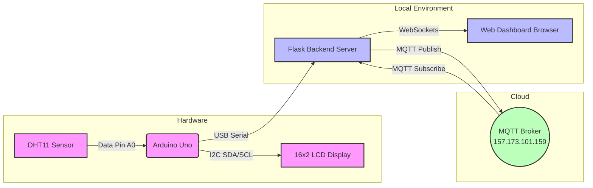

# DHT11 Temperature Monitoring System

This project reads temperature data from a DHT11 sensor using an Arduino Uno, displays it on a 16x2 I2C LCD, and transmits the data over a USB Serial connection to a local PC. The PC runs a full-stack Flask backend that pushes data to an MQTT broker, and streams it live to a web dashboard using WebSockets.

## System Architecture



## Hardware Setup

### Wiring Connections

**DHT11 to Arduino Uno**
- `DHT11 VCC` -> `5V`
- `DHT11 GND` -> `GND`
- `DHT11 DATA` -> `A0`

**16x2 LCD (with I2C Backpack) to Arduino Uno**
- `LCD VCC` -> `5V`
- `LCD GND` -> `GND`
- `LCD SDA` -> `A4`
- `LCD SCL` -> `A5`

## 1. Arduino Setup

1. Open `arduino_dht11/arduino_dht11.ino` in the Arduino IDE.
2. Install the required libraries via the Arduino Library Manager:
   - **DHT sensor library** by Adafruit
   - **LiquidCrystal I2C** by Frank de Brabander
3. Connect your Arduino Uno to your PC via USB.
4. Select your board and COM port in the Arduino IDE.
5. Click **Upload**.

*Note: The LCD will display "Aaron - DHT11 Temp Monitoring". Because this text is longer than 16 characters, it will automatically scroll horizontally across the first row.*

## 2. Server & Dashboard Setup (using `venv`)

The PC acts as the central hub. It runs a Python Flask server (`server.py`) that handles Serial reading, MQTT publishing, and serves the real-time Web Dashboard using Socket.IO.

It is highly recommended to run this inside a virtual environment (`venv`).

### Installation Steps

1. Open your terminal in this directory (`/home/twarimitswe_aaron/Documents/exam_dht11`).
2. Create a new virtual environment:
   ```bash
   python3 -m venv venv
   ```
3. Activate the virtual environment:
   - On Linux/macOS:
     ```bash
     source venv/bin/activate
     ```
   - On Windows:
     ```bash
     venv\Scripts\activate
     ```
4. Install the required Python packages:
   ```bash
   pip install pyserial paho-mqtt flask
   ```

### Running the System

Ensure the Arduino is plugged in, and run the server script:
```bash
python server.py
```

The script will automatically:
1. Detect the Arduino's COM port and start reading temperature data.
2. Connect to the MQTT Broker (`157.173.101.159`) to publish data.
3. Catches its own MQTT messages and instantly broadcasts them to the Web Dashboard.
4. Host the web server.

**To view the Dashboard:** Open your web browser and go to `http://127.0.0.1:5000`.

## Troubleshooting

### 1. `[Errno 16] Device or resource busy`
If you encounter this error when running the Python script, it means another program is actively using the USB serial port. **You must close the Arduino IDE's Serial Monitor** (or the entire Arduino IDE) before running the Python script. Only one program can connect to the serial port at a time.

### 2. `ValueError: Unsupported callback API version`
This error occurs if you are using an older version of the Python script with `paho-mqtt` version 2.0.0+. The script in this repository has already been updated to include `mqtt.CallbackAPIVersion.VERSION1` in the client initialization to resolve this issue.
