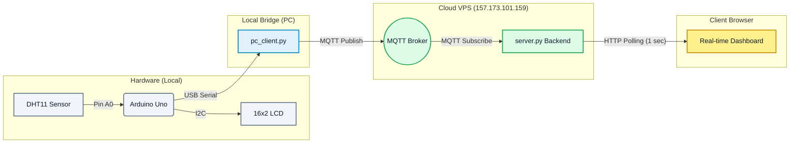

# DHT11 Cloud IoT Monitoring System

This project is a fully decoupled, production-ready IoT architecture for reading temperature data from a local DHT11 sensor and broadcasting it to a real-time web dashboard hosted in the cloud.

The system is designed with a strict **Separation of Concerns**, ensuring the local hardware is entirely decoupled from the cloud backend.

## 🏗 System Architecture Diagram



### 🔌 How Communication Works (The O(1) Pathway)

1. **Sensing**: The Arduino Uno continuously reads the DHT11 sensor and writes strings (e.g., `TEMP:24.5`) to the USB Serial port.
2. **Publishing**: The local script `pc_client.py` auto-detects the Arduino, reads the serial stream, and instantly publishes the temperature to the cloud MQTT broker.
3. **Subscribing**: The cloud backend `server.py` runs permanently on the VPS. It subscribes to the MQTT broker and securely stores the single latest temperature in memory. **No database (SQLite) is used**, ensuring O(1) lookup speed and zero disk-write bottlenecks.
4. **Visualizing**: The web dashboard polls the backend's `/api/latest` endpoint every 1 second, dynamically updating a beautifully animated `Chart.js` graph.

---

## 🛠 1. Hardware Setup

### Wiring Connections

**DHT11 to Arduino Uno**
- `DHT11 VCC` → `5V`
- `DHT11 GND` → `GND`
- `DHT11 DATA` → `A0`

**16x2 LCD (with I2C Backpack) to Arduino Uno**
- `LCD VCC` → `5V`
- `LCD GND` → `GND`
- `LCD SDA` → `A4`
- `LCD SCL` → `A5`

### Arduino Firmware
1. Open `arduino_dht11/arduino_dht11.ino` in the Arduino IDE.
2. Install the **DHT sensor library** (by Adafruit) and **LiquidCrystal I2C** (by Frank de Brabander).
3. Upload the sketch to your board.

---

## 🚀 2. Local Bridge Setup (Your PC)

The local script's only job is to bridge the USB connection to the internet.

1. Ensure the Arduino is plugged into your PC via USB.
2. Install the required Python packages:
   ```bash
   pip install pyserial paho-mqtt
   ```
3. Run the publishing script:
   ```bash
   python pc_client.py
   ```
   *The script will automatically find the Arduino COM port and begin pushing data.*

---

## ☁️ 3. Cloud Backend Setup (The VPS)

The backend code strictly runs in the cloud to host the API and website. 

1. SSH into your VPS:
   ```bash
   ssh user271@157.173.101.159
   ```
2. Set up the environment and install dependencies:
   ```bash
   python3 -m venv venv
   source venv/bin/activate
   pip install flask paho-mqtt
   ```
3. Start the server as a background process on port `9271`:
   ```bash
   nohup python3 server.py 9271 > server.log 2>&1 &
   ```

---

## 📊 4. View the Dashboard

Once both scripts are running, you can access your real-time dashboard from anywhere in the world.

Open your browser (preferably an Incognito Window to prevent AdBlocker interference) and navigate to:
**http://157.173.101.159:9271**
